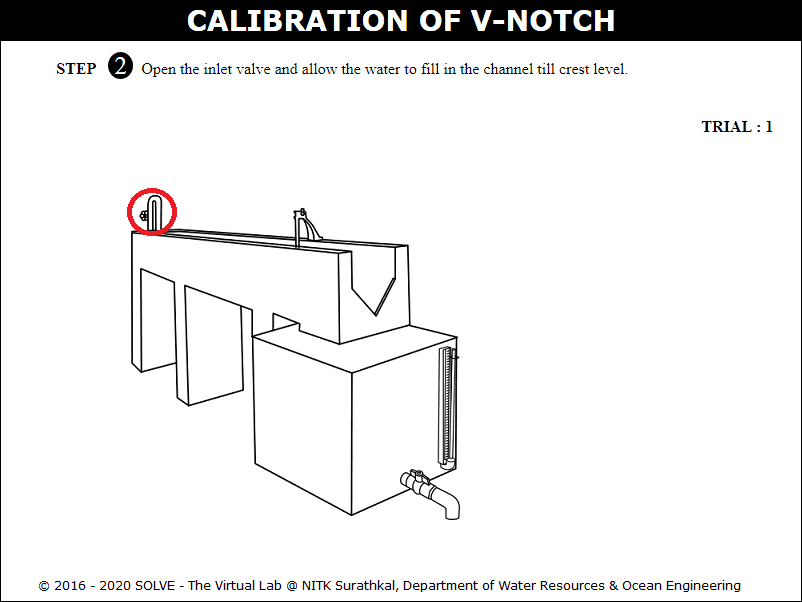
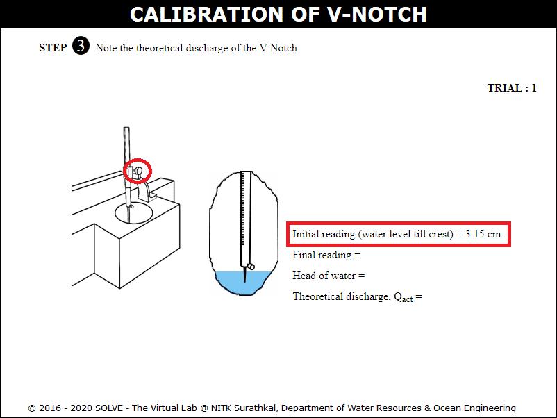
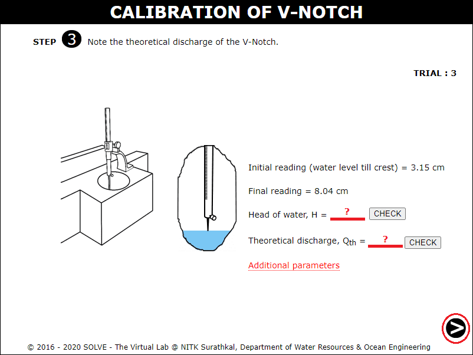
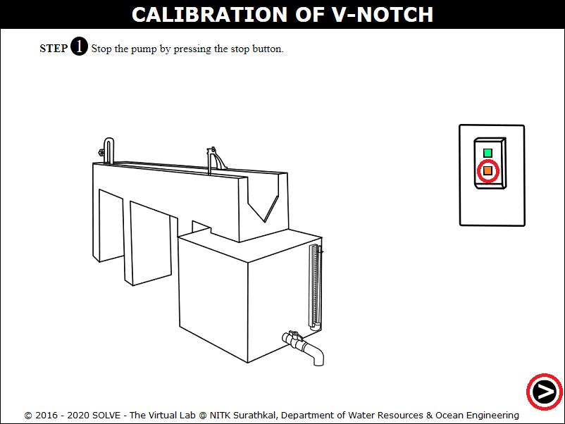
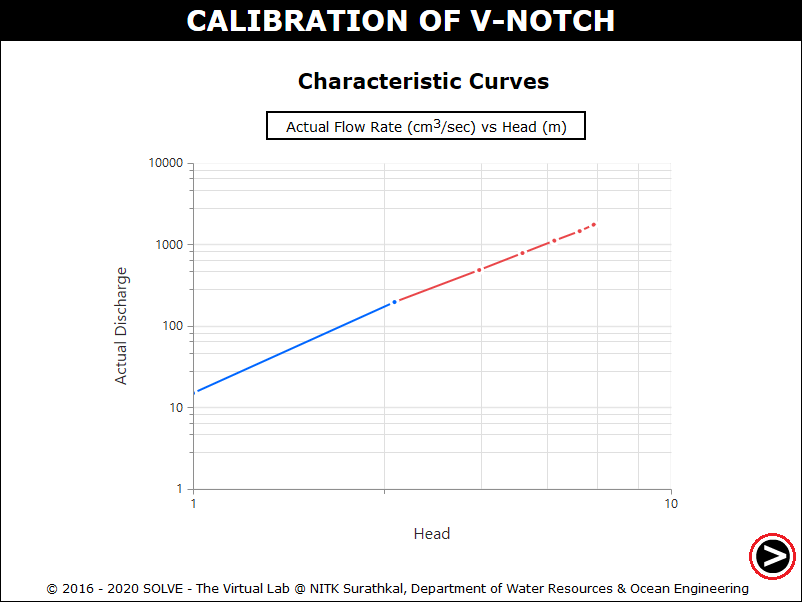

#### These procedure steps will be followed on the simulator

<ol>
 <li> Open the Calibration of V-notch experiment and click on the next button shown at the bottom right corner.
 

 </li>

 <li>Start the pump by clicking on green button and then click on the next button.
 

 </li>

 <li> Click on the inlet valve to rotate it.
 

 </li>

 <li> Click on hand to rotate the inlet valve and click on the next button.
 

 </li>

 <li> Note the initial reading of the hook gauge and click on the knob.
 

 </li>

 <li> Calculate head of water and theoretical discharge. Then click the next button.
 

 </li>

 <li> Click on ball valve to close it and allow the water to rise in collecting tank.
 

 </li>

 <li> Calculate actual discharge of V-notch and click on the next button.
 

 </li>

 <li> Repeat the same procedure, after certain trials, click on the red button to stop the pump and click on the next button.
 

 </li>

 <li> Click on the label button to see the graph.
 

 </li>

 <li> Click on next button to see the results obtained by the graph.
 

 </li>

 <li> Note the results obtained by the graph.
 

 </li>
</ol>
