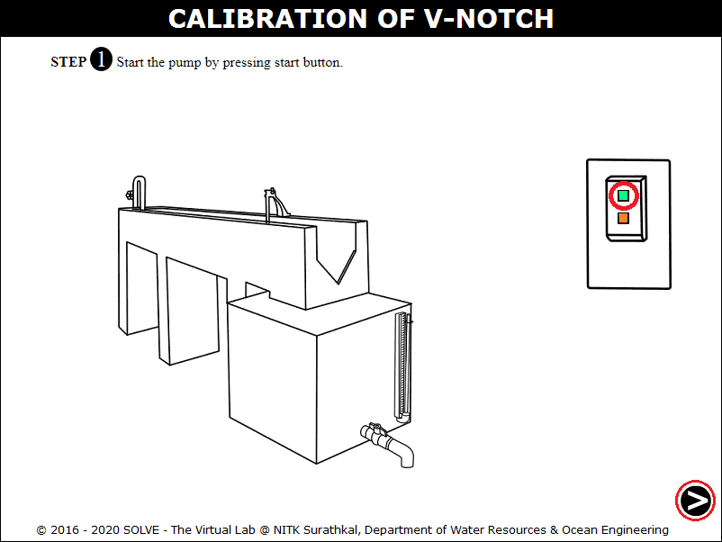
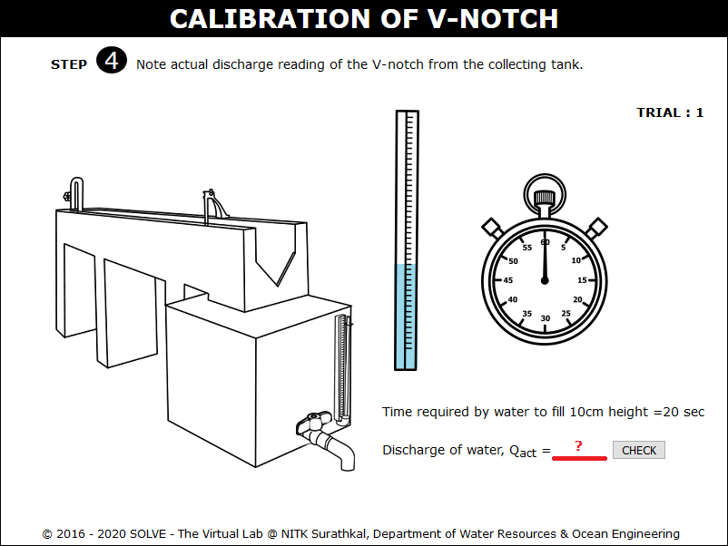
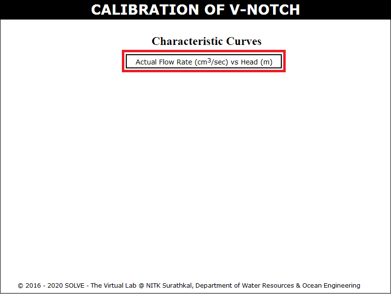

<h3><b>These procedure steps will be followed on the simulator</b></h3>

<ol>
 <li> Open the Calibration of V-notch experiment and click on the next button shown at the bottom right corner. 
 

 
 </li>

 <li>Start the pump by clicking on green button and then click on the next button. 
 

 
 </li>

 <li> Click on the inlet valve to rotate it. 
 

 
 </li>

 <li> Click on hand to rotate the inlet valve and click on the next button. 
 

 
 </li>

 <li> Note the initial reading of the hook gauge and click on the knob. 
 

 
 </li>

 <li> Calculate head of water and theoretical discharge. Then click the next button. 
 

 
 </li>

 <li> Click on ball valve to close it and allow the water to rise in collecting tank.  
 

 
 </li>

 <li> Calculate actual discharge of V-notch and click on the next button. 
 

 
 </li>

 <li> Repeat the same procedure, after certain trials, click on the red button to stop the pump and click on the next button. 
 

 
 </li>

 <li> Click on the label button to see the graph. 
 

 
 </li>

 <li> Click on next button to see the results obtained by the graph. 
 

 
 </li>

 <li> Note the results obtained by the graph. 
 

 
 </li>
</ol>
