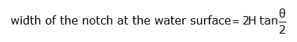
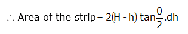
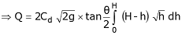

### INTRODUCTION 

A notch is an opening in the side of a measuring tank or reservoir extending above the free surface. These notches are used to measure discharge of open channel flows, by passing or placing or constructing them across the stream. Notches are generally used for measuring discharge in small open channels or laboratory flumes.

Notches can be of different shapes such as triangular, rectangular, trapezoidal, stepped notch, etc. the bottom of the notch over which the water flows is known as crest or sill and the thin sheet of water flowing through the notch is known as nappe or vein. The edges of the notch are bevelled on the downstream side so as to have a sharp-edged sides and crest resulting in minimum
contact with the flowing fluid.
 

 

The discharge over notch is measured by measuring the head acting over the notch. As water approaches the notch, its surface becomes curved. Therefore, the head over the notch is to be measured at the upstream of the notch where the effect of curvature is minimum. Also, it should be close to the notch so that the loss of energy between head measuring section and notch is negligible. In practical, the head over notch is measured at a distance of 3 to 4 times the maximum head from the notch.
 

<b>V-notch or Triangular notch</b>
 

  

The V-notch or triangular notch is sharp crested notch, which is maily used to determine the low rate of flow.
 

  

Let,

H = Height of the liquid above the apex of the notch

&theta; = Angle of the notch

Cd = Coefficient of discharge

From the geometry of the figure, we find that,

We know that the theoretical velocity of water through the strip

 

and discharge over the notch,
 

 
 

The total discharge over the whole notch may be found out only by integrating the above equation within the limits 0 and H.
 

  
  
  
  
  
  
   
